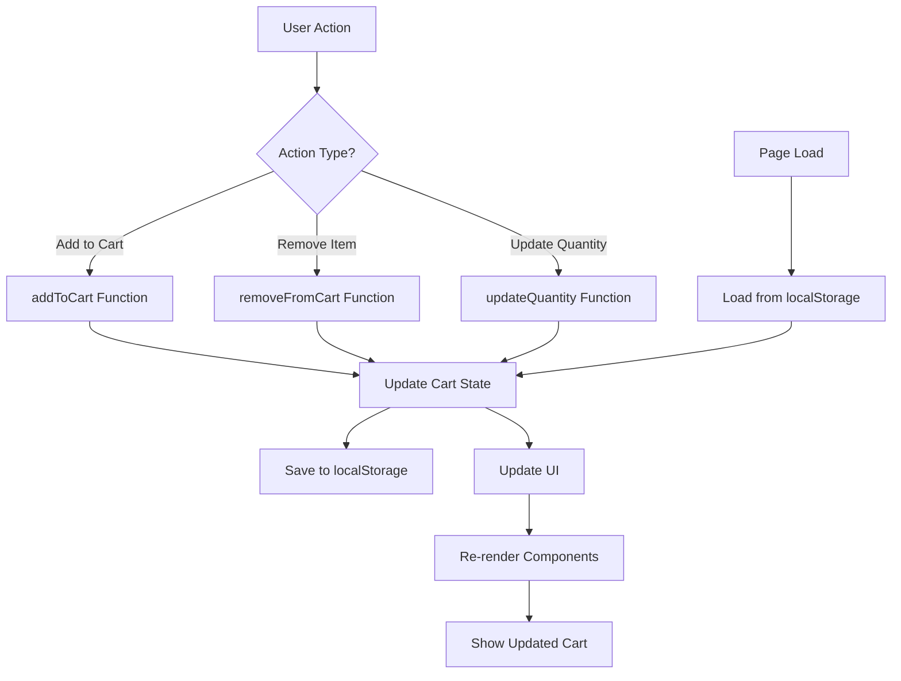
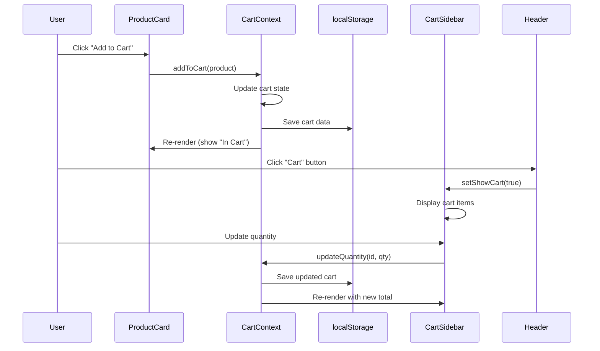
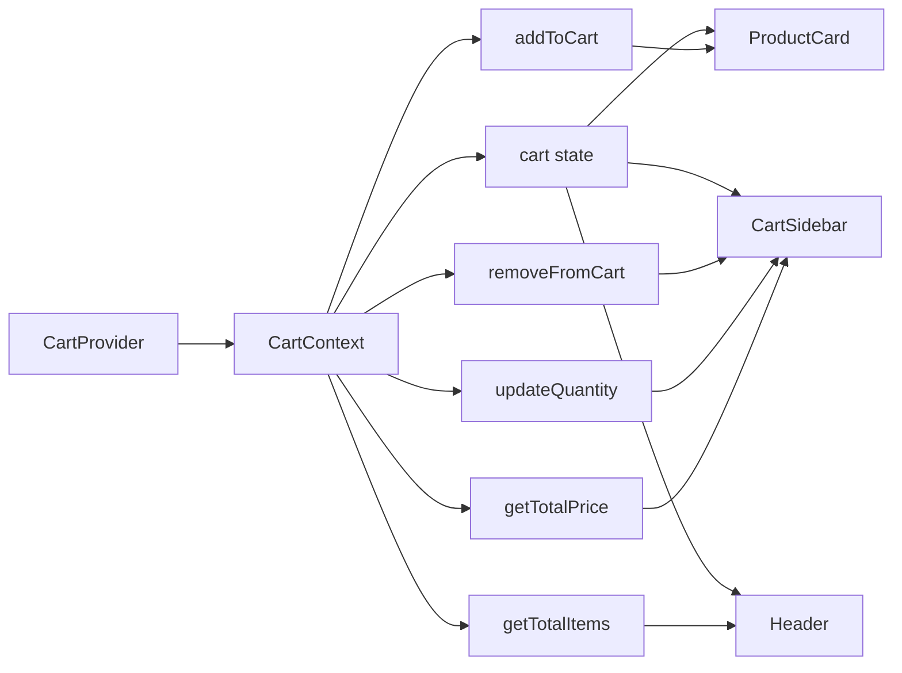
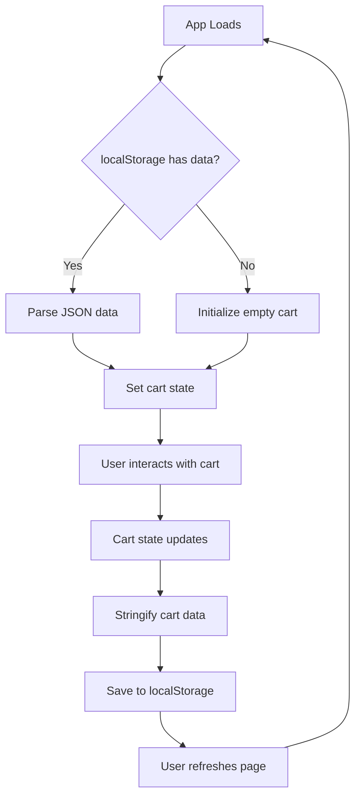

# 🛒 ReactJS Shopping Cart Application

A fully functional e-commerce shopping cart application built with ReactJS, featuring real-time cart updates, persistent storage, product filtering, and a modern UI.

## 📋 Table of Contents
- [Features](#features)
- [Architecture](#architecture)
- [Tech Stack](#tech-stack)
- [Installation](#installation)
- [Usage](#usage)
- [Project Structure](#project-structure)
- [Workflow](#workflow)
- [Future Enhancements](#future-enhancements)

---

## ✨ Features

### Core Features
- ✅ **Product Listing** - Display products with name, price, image, and stock information
- ✅ **Add to Cart** - Add products to shopping cart with visual feedback
- ✅ **Remove from Cart** - Delete items from cart
- ✅ **Update Quantity** - Increment/decrement product quantities with stock validation
- ✅ **Dynamic Total Calculation** - Real-time price updates
- ✅ **Cart Sidebar** - Slide-out cart panel with semi-transparent overlay
- ✅ **Responsive Design** - Works seamlessly on desktop and mobile devices

### Bonus Features
- 🎁 **localStorage Persistence** - Cart data survives page refreshes
- 🎁 **Product Filters** - Filter by category (Electronics, Fashion, Home)
- 🎁 **Price Range Filter** - Filter products by price range ($0-$300)
- 🎁 **Mock Checkout** - Checkout button with success confirmation animation
- 🎁 **Stock Management** - Prevents adding more items than available stock
- 🎁 **Visual Indicators** - Badge showing total items in cart

---

## 🏗️ Architecture

### Component Hierarchy

```
ShoppingCartApp (Root)
└── CartProvider (Context)
    └── App
        ├── Header
        │   └── Cart Button (with badge)
        ├── ProductList
        │   ├── Filters (Category & Price)
        │   └── ProductCard (multiple)
        │       └── Add to Cart Button
        └── CartSidebar
            ├── Cart Header
            ├── CartItem (multiple)
            │   ├── Product Image
            │   ├── Quantity Controls (+/-)
            │   └── Remove Button
            └── Cart Footer
                ├── Total Calculation
                └── Checkout Button
```

### State Management Flow

The application uses **React Context API** for global state management:

- **CartContext**: Centralized cart state accessible throughout the app
- **CartProvider**: Wraps the entire application and provides cart methods
- **useCart Hook**: Custom hook for consuming cart context in components

---

## 💻 Tech Stack

- **Frontend Framework**: React 18.x
- **Language**: JavaScript (ES6+)
- **Styling**: Tailwind CSS (utility-first CSS framework)
- **Icons**: Lucide React
- **State Management**: React Context API + useState
- **Storage**: localStorage API
- **Build Tool**: Create React App

---

## 🚀 Installation

### Prerequisites
- Node.js (v14 or higher)
- npm or yarn

### Steps

1. **Clone the repository**
```bash
git clone https://github.com/Narendra9906/Shopping_Cart
cd Shopping_Cart
```

2. **Install dependencies**
```bash
npm install
```

3. **Install required packages**
```bash
npm install lucide-react
```

4. **Start the development server**
```bash
npm start
```

5. **Open browser**
Navigate to `http://localhost:5173`

---

## 📖 Usage

### Adding Products to Cart
1. Browse the product list on the homepage
2. Click "Add to Cart" button on any product
3. Button changes to "In Cart" with quantity indicator

### Managing Cart Items
1. Click the "Cart" button in the header to open the cart sidebar
2. Use **+** and **-** buttons to adjust quantities
3. Click the **trash icon** to remove items
4. View real-time total at the bottom

### Filtering Products
1. Select a category button (All, Electronics, Fashion, Home)
2. Adjust the price range slider to filter by price
3. Products update automatically

### Checkout
1. Click the green "Checkout" button in the cart
2. See confirmation message with checkmark animation
3. Cart clears automatically after 3 seconds

---

## 📁 Project Structure

```
Shopping Cart/
├── 📂 public/
│ ├── 🖼 shop.jpg
│ └── 🧩 vite.svg
│
├── 📂 src/
│ ├── 📂 assets/
│ ├── 🎨 App.css
│ ├── ⚛ App.jsx
│ ├── 🎨 index.css
│ └── ⚛ main.jsx
│
├── ⚙ .gitignore
├── ⚙ eslint.config.js
├── 🧱 index.html
├── 📦 package-lock.json
├── 📦 package.json
├── 📘 README.md
├── 🗂 shopping cart.zip
└── ⚙ vite.config.js
```

### Key Files

- **App.js**: Contains all components and main application logic
- **CartContext**: Global state management for cart operations
- **localStorage**: Persists cart data across sessions

---

## 🔄 Workflow

### Data Flow Diagram



### Component Interaction Flow



### State Management Architecture



### localStorage Persistence Flow



---

## 🎨 Design Decisions

### Why Context API?
- Avoids prop drilling through multiple component layers
- Centralized state management for cart operations
- Easy to test and maintain
- No external dependencies required

### Why localStorage?
- Simple browser API for persistence
- No backend required
- Data persists across sessions
- Synchronous operations (no async complexity)

### Why Tailwind CSS?
- Rapid UI development with utility classes
- Responsive design built-in
- Consistent spacing and colors
- Small bundle size with purging

---

## 🔮 Future Enhancements

- [ ] Add user authentication
- [ ] Integrate payment gateway (Stripe/PayPal)
- [ ] Add product search functionality
- [ ] Implement product reviews and ratings
- [ ] Add wishlist feature
- [ ] Multi-currency support
- [ ] Order history tracking
- [ ] Email notifications
- [ ] Backend API integration
- [ ] Database for products and orders

---

## 📝 Assignment Compliance

### ✅ All Requirements Met

| Requirement | Status | Implementation |
|------------|--------|----------------|
| Product List | ✅ | 6 products with all required attributes |
| Shopping Cart | ✅ | Separate component with all features |
| Add to Cart | ✅ | Click handler with state update |
| Remove from Cart | ✅ | Delete button with confirmation |
| Update Quantity | ✅ | +/- buttons with stock validation |
| Total Calculation | ✅ | Real-time updates on all changes |
| State Management | ✅ | Context API implementation |
| UI/UX | ✅ | Tailwind CSS with responsive design |
| localStorage | ✅ | Automatic persistence |
| Filters | ✅ | Category and price range |
| Checkout | ✅ | Mock confirmation message |

---

## 👨‍💻 Author

**Your Name**
- GitHub: https://github.com/Narendra9906/Shopping_Cart
- Email: narendralal6372@gmail.com

---

## 📄 License

This project is created as a part of the Vistora AI Web Development Assignment.

---

## 🙏 Acknowledgments

- Vistora AI for the assignment opportunity
- Unsplash for product images
- Lucide React for icons
- Tailwind CSS for styling framework

---

**Last Updated**: November 2025
